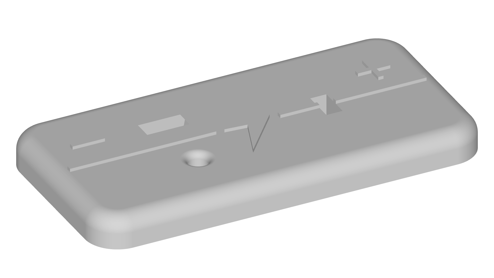
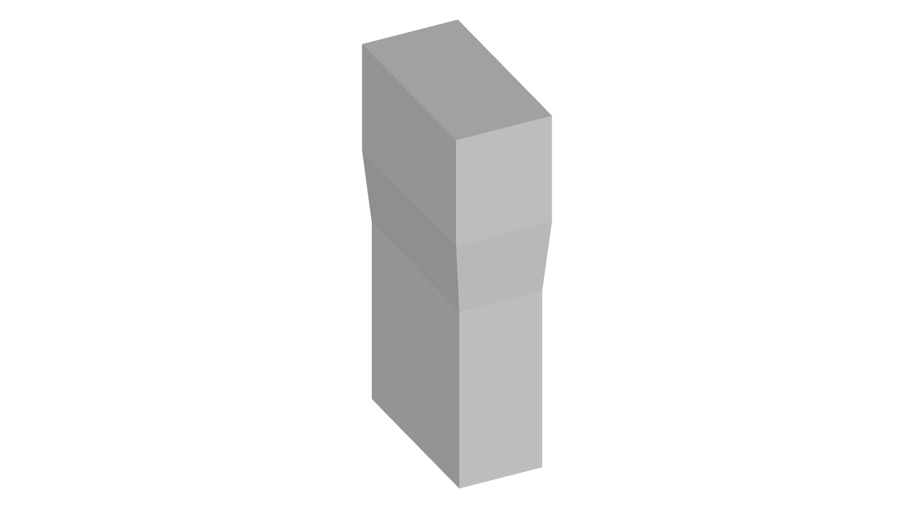
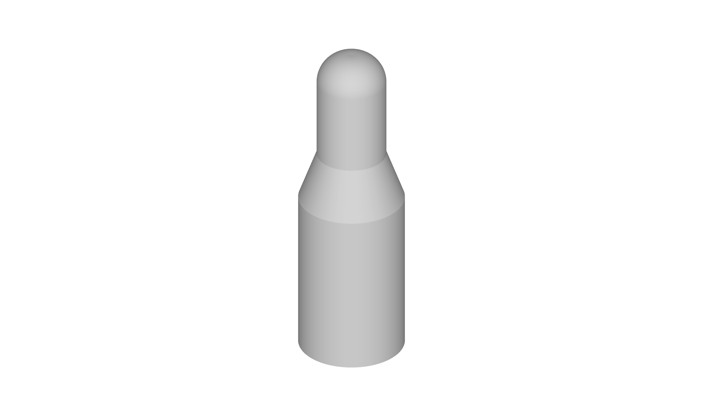

# ⚡ Module: Power Supply

**Warning:** **Never include more than one `power_supply` module in a single circuit**—this can damage components!

This module provides safe 5V power to the rest of your circuit via a **USB‑C connector** (e.g. \[Amazon product link]) and includes built‑in short‑circuit protection.

---

## 🎨 3D Models

Please print the following parts:

* `top.stl`
  
  (If possible, print in two colors for contrast)

* `window.stl`
  
  (Use **transparent filament** so you can see LED indicators)

* `button.stl`
  
  (Print in a bright color for visibility)

* Base: `bases/base_line_1x2.stl`
  (Standard 1×2 base)
  

After printing, insert the **brass inserts** into the `top` piece using a soldering iron before assembly.

---

## 🔩 PCB Assembly & Flashing

Inside the `pcb/` directory, you’ll find:

* Gerber files
* Pick‑and‑place file
* BOM (Bill of Materials)

### 🛠️ Manufacturing Your PCB

You can manufacture and assemble the PCB using any PCB fabrication service. You can follow this [tutorial](https://train-science.com/order-pcbs-easily-at-jlcpcb-a-step-by-step-guide/)

### 🧠 Installing Arduino Nano & Flashing Firmware

Mount an **Arduino Nano** on the PCB socket, and solder it in place. Once soldered:

* Open the Arduino IDE.
* Select your board: **Arduino Nano**.
* Choose the correct port under **Tools > Port**.
* Load the `power_supply.ino` sketch and click **Upload**.

---

## 🔌 Wiring & Final Assembly

1. **Wire connections**

   * **P1**: USB‑C input connector
   * **P2**: Metal tabs for connecting other modules
   * Be extra careful: make sure polarity is correct when wiring!

2. **Enclosure & buttons**

   * Insert `window.stl` into the `top` shell so LEDs are visible
   * Snap in the `button.stl` part
   * Attach the `top` to the base with screws into the brass inserts

And… **TADA!** Your power module is complete.
